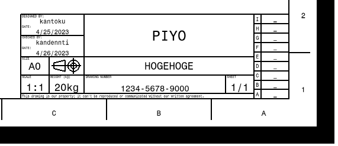
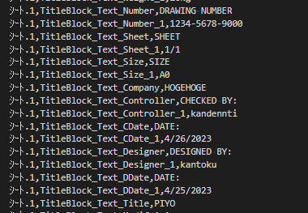
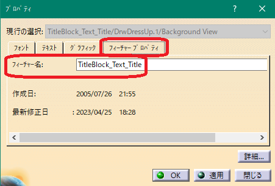
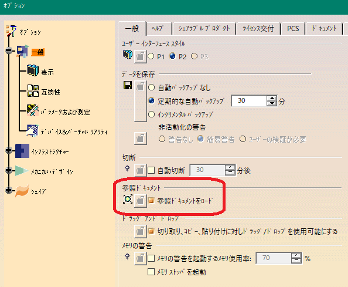

# ***CATIA V5 BackgroundViewTexts***

本スクリプトは、CATIA V5用のVBスクリプトです。
CATDrawingファイルをアイコンにドラッグ＆ドロップする事で、バックグラウンドビュー(背面図)内のテキスト文字を抜き出し、CSVファイルを作成します。

---

## **これは何？**:

以下が特徴です。

+ CATDrawingファイルをドラッグ＆ドロップする事で、ディテールシートを除く全てのシートの背面図の文字をCSVファイルでエクスポートします。(複数ファイル可)
+ バッチモードでCATIA V5を起動させ抽出処理を行う為、あなたの他の作業の邪魔をしません。
+ あなたが使用しているCATIA V5の環境に合わせて抽出処理を行います。

---

## **インストール**:

zipファイルをダウンロードし展開して下さい。

---

## **使用方法**:

最低限必要となるファイルは"script"フォルダに入っている以下の2個となります。

+ BackgroundViewTexts.vbs
+ BackgroundViewTexts.CATScript

#### - 準備 -

事前に、バッチ起動する為のCATIA V5の環境情報を取得する必要があります。

この作業は、1度だけ行えば大丈夫です。

※環境とは、リリース・ホットフィックスや、オプションの設定状態です。

+ CATIA V5を起動します。※複数起動している場合は、最初に起動した環境を取得します。
+ "BackgroundViewTexts.vbs" をダブルクリックします。
+ 同一のフォルダ内に "Cat-Dll_Env-Path.txt" と言うファイルが出来上がれば終了です。

#### - 実行 -

**"BackgroundViewTexts.vbs"** にCATDrawingファイルをドラッグ＆ドロップしてください。

**※実際の作業では、ショートカットを作成しての運用を強く推奨します。**

+ D&DされたCATDrawingファイルと同一フォルダ内に、CSVファイルが作成されます。
+ 複数ファイルD&Dされた場合、順番に処理します。
+ 拡張子 ".CATDrawing" のファイル以外のファイルは無視します。
+ 抽出後のcsvファイル名が同一となってしまうファイルが存在する場合、"xxxx_1.csv"のようなナンバリング付きのファイル名となります。(上書き保存は行いません)
+ 処理時はCATDrawingファイルを開き必要な情報の取得後に閉じており、保存等は行っておりません。(要は変更はしません)

[デモ動画](https://vimeo.com/821134494?share=copy)

#### - 処理後のファイル -

この様な図面の表題欄が背面図に入っているとします。



出力されるCSVファイルは以下様になります。



```csv:csvフォーマット
シート名 , フィーチャー名 , 実際の文字
```
※フィーチャー名はテキストのプロパティを開いた際のこちらになります。



出力文字には以下の制約が有ります。

- 改行が含まれるものはアンダーバー(_)に変換されます。
- カンマ(,)が含まれるものはアンダーバー(_)に変換されます。

---

## **複数環境で使用する**:

客先別で異なるリリースをインストールし運用している企業もあるかと思います。

仮に "R2018SP4" と "R2022SP2" を使用しているとします。

+ 予め環境用のフォルダを用意します。
    + "C:\sprict\r2018sp4" と "C:\sprict\r2022sp2" の様に
+ それぞれのフォルダに "BackgroundViewTexts.vbs" "BackgroundViewTexts.CATScript" コピーペーストする。
+ 各フォルダに基づいたCATIA V5を起動し、"BackgroundViewTexts.vbs" をダブルクリックし "Cat-Dll_Env-Path.txt" ファイルをそれぞれに作成する。
+ それぞれのフォルダの "BackgroundViewTexts.vbs" のショートカットをデスクトップに作成し、ショートカットの名称を分かりやすいように変更する。

このそれぞれのショートカットへファイルをD&Dする事で、環境に基づいた処理を行う事が可能です。

---

## **注意点**:

- 処理前・処理後に表示されるダイアログの文字数に制限が有る為、大量のファイルをD&Dした場合、全てのメッセージを表示しきれない場合が有ります。

- 本スクリプトでは、処理を早めるためにオプションの"一般"-"参照ドキュメント"の"参照ドキュメントをロード"のチェックを一時的に外しております。正常に終了した場合は問題ありませんが、エラーとなった場合や処理が終わらない場合は、実行前の状態と異なっている場合が有りますので、確認してください。


---

## **条件**:

- CATIA V5が起動可能なPC

---

## **アクション**:

以下の環境で確認済みです。

+ CATIA V5_6 R2018SP4,R2022SP2

+ Windows10 64bit Pro

---

## **ライセンス**:

- Apache License 2.0